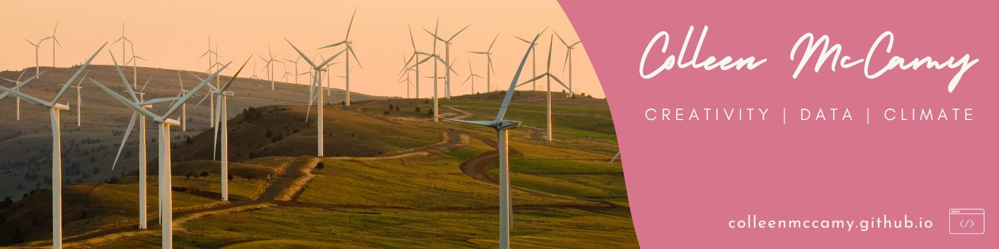

# Hi I am Colleen McCamy and welcome to my GitHub.

I am a self-proclaimed energy nerd passionate about the intersection of climate, creativity and community. 

My GitHub account is a work in progress but for some more polished updates check out my blog at [https://colleenmccamy.github.io/](https://colleenmccamy.github.io/blog.html).

Pronouns: she/her

### :mushroom: Languages I Use:

    &nbsp;
  &nbsp;
  &nbsp;
  &nbsp;

### :cactus: My GitHub Wrapped:

### You're not alone! Here is the count of profile views.
(as of July 2024)

<!--
**colleenmccamy/colleenmccamy** is a ✨ _special_ ✨ repository because its `README.md` (this file) appears on your GitHub profile.

Here are some ideas to get you started:

- 🔭 I’m currently working on ...
- 🌱 I’m currently learning ...
- 👯 I’m looking to collaborate on ...
- 🤔 I’m looking for help with ...
- 💬 Ask me about ...
- 📫 How to reach me: ...

- ⚡ Fun fact: ...
-->
